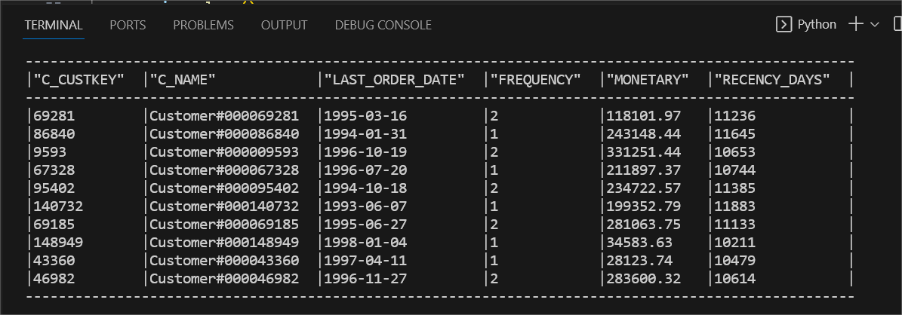
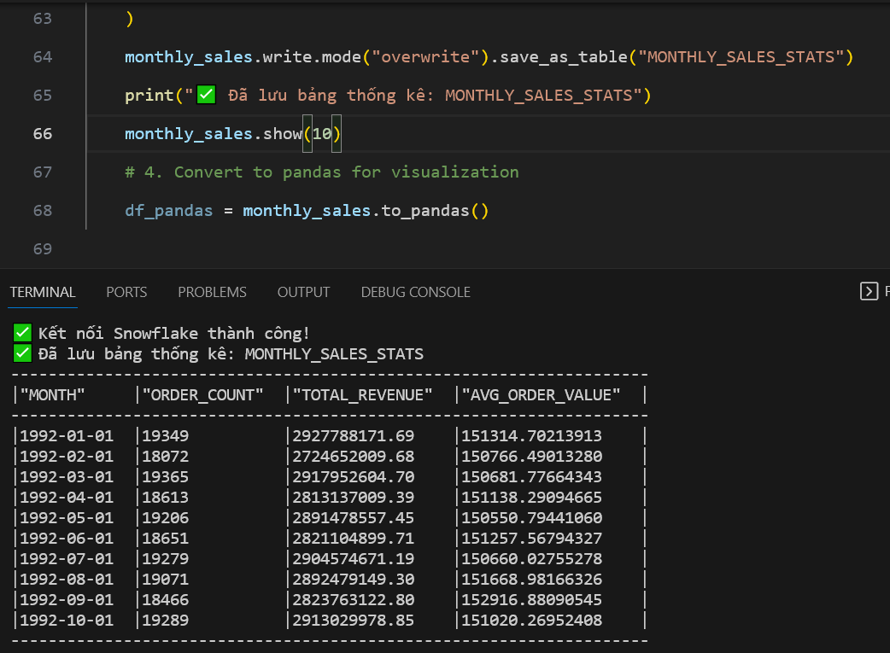
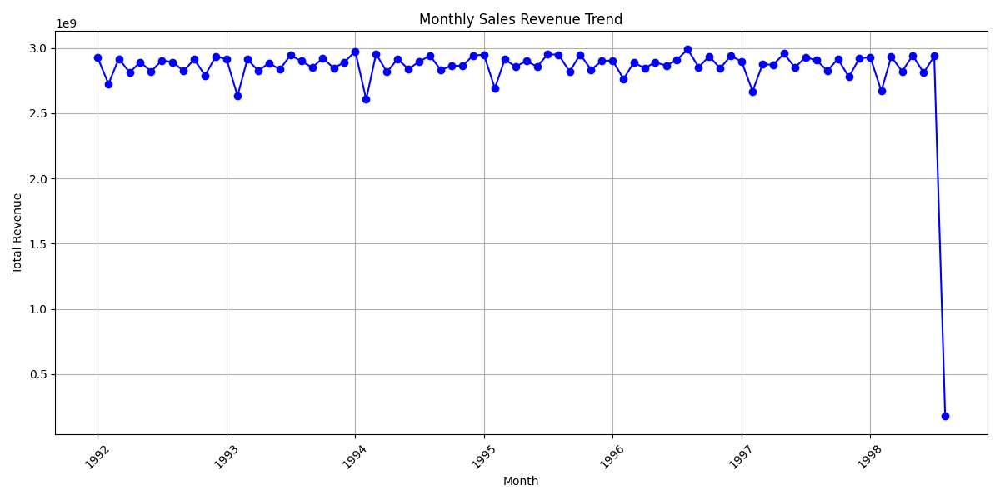

# ❄️ Analytics Engineer Project : Snowflake, dbt & Snowpark Python


## 1. Tổng quan dự án (Project Overview)

Dự án này xây dựng một DataWarehouse (Áp dụng mô hình Star Schema) và pipeline cơ bản sử dụng **Modern Data Stack**. Mục tiêu để phân tích dữ liệu bán hàng (TPC-H dataset), phân khúc khách hàng và dự báo xu hướng doanh thu.

**Công nghệ sử dụng:**

- **Data Warehouse:** Snowflake
- **Transformation:** dbt (data build tool)
- **Analytics & ML:** Snowpark Python
- **Environment Management:** Python-doten

**Data Flow Architecture:**


## 2. Cấu trúc dự án

```text
Snowflake-TPCH-Project/
│
├── dbt/                        # Source code dbt (Data Transformation)
│   ├── analysis/
│   ├── models/                 # Chứa các file .sql biến đổi dữ liệu (Staging -> Marts)
│   ├── seeds/                  # Chứa file csv dữ liệu thô (nếu có)
│   ├── tests/                  # Các file test logic dữ liệu
│   └── dbt_project.yml         # Cấu hình chính của dbt
│
├── python/                     # Source code Python & Snowpark
│   ├── .env                    # Biến môi trường (Credentials - KHÔNG UP FILE NÀY)
│   └── 05_snowpark.py          # Script chạy RFM Analysis & Sales Trend
│
├── sql/                        # Các scripts quản trị Database (Infrastructure)
│   ├── 01_database_stage_roles.sql       # Tạo Database, Warehouse, Schema, phần quyền, roles
│   ├── 02_medallion_data_pipeline_automation.sql      # Tạo pipe, stream, procedure, task
│   ├── 03_data_profilling_quality_check    # Khám phá dữ liệu, tạo quality check
│   ├── 04_masking_policies_secure_data_sharing # Tạo masking policies
│   └── 05_udfs.sql             # Tạo hàm User Defined Functions
│
└── README.md                   # Tài liệu hướng dẫn dự án
```

## 3. Hướng dẫn Setup (Setup Guide)

### 3.1. Chuẩn bị môi trường

Đảm bảo bạn đã cài đặt:

- **Python 3.8+**

- **dbt-snowflake**

- **Tài khoản Snowflake (Account Admin)**

### 3.2. Cài đặt thư viện Python

Chạy lệnh sau để cài các gói cần thiết cho Snowpark:

```bash
pip install snowflake-snowpark-python pandas python-dotenv matplotlib
```

### 3.3. Cấu hình bảo mật (.env)

Sửa file .env trong thư mục python/ với nội dung (thay bằng thông tin của bạn)

### 3.4. Khởi tạo Database & Phân quyền

Chạy đoạn script ( trong file **01_database_stage_roles.sql** ) trên Snowflake Worksheet để tạo database schemas và phân quyền

```sql
-- Tạo database cho dự án
CREATE OR REPLACE DATABASE TPCH_ANALYTICS_DB;
-- Tạo các schemas
CREATE OR REPLACE SCHEMA TPCH_ANALYTICS_DB.STAGING; -- Dữ liệu gốc từ files
CREATE OR REPLACE SCHEMA TPCH_ANALYTICS_DB.ANALYTICS; -- Dữ liệu đã biến đổi
CREATE OR REPLACE SCHEMA TPCH_ANALYTICS_DB.REPORTS; -- Báo cáo cuối cùng
CREATE OR REPLACE SCHEMA TPCH_ANALYTICS_DB.UDFS; -- User-define function
-- Tạo internal stage cho data files
STAGE TPCH_DATA_STAGE -- Stage chứa TPC-H data files
```

```sql
-- Tạo các roles cho dự án
CREATE OR REPLACE ROLE TPCH_ADMIN;        -- Quản trị toàn bộ
CREATE OR REPLACE ROLE TPCH_DEVELOPER;    -- Developer: Load data, transform
CREATE OR REPLACE ROLE TPCH_ANALYST;      -- Analyst: Query, report
CREATE OR REPLACE ROLE TPCH_VIEWER;       -- Viewer: Chỉ xem reports
-- Grant quyền phù hợp cho các roles trên schemas
--- Admin role
GRANT ALL PRIVILEGES ON DATABASE TPCH_ANALYTICS_DB TO ROLE TPCH_ADMIN;
GRANT ALL PRIVILEGES ON ALL SCHEMAS IN DATABASE TPCH_ANALYTICS_DB TO ROLE TPCH_ADMIN;
--- Các quyền khác tương tự như trong file
```

Tạo các bảng RAW

```sql
-- B1: Chọn schema chứa các bảng raw
USE DATABASE TPCH_ANALYTICS_DB;
USE SCHEMA STAGING;
-- B2: Tạo các bảng raw
-- Bảng 1: REGION
CREATE OR REPLACE TABLE REGION (
  R_REGIONKEY NUMBER(38,0),
  R_NAME VARCHAR(25),
  R_COMMENT VARCHAR(152)
);
-- Bảng 2: NATION
CREATE OR REPLACE TABLE NATION (
  N_NATIONKEY NUMBER(38,0),
  N_NAME VARCHAR(25),
  N_REGIONKEY NUMBER(38,0),
  N_COMMENT VARCHAR(152)
);
-- Tạo tương tự cho các bảng khác
```

Load Dữ Liệu từ Files vào Stages

## 4. Hướng dẫn chạy (Execution Guide)

### Bước 1: Data Transformation với dbt

Di chuyển vào thư mục dbt và chạy các lệnh:

```bash
dbt deps    # Cài đặt packages
dbt seed    # Load dữ liệu thô (nếu có)
dbt run     # Chạy các models (Staging -> Marts)
dbt test    # Kiểm tra chất lượng dữ liệu
```

**Kết quả:** Tạo ra các view (stg_order, stg_customer, ....) ở phần STAGING và tạo ra các table dim, fact ở phần ANALYTICS

**Linage Graph Data Transform Flow:**


### Bước 2: Data pipeline automation

Chạy file **02_medallion_data_pipeline_automation.sql** để tạo ra các pipe, stream, procedure, task, để tự động merge data vào các bảng raw cũng như là bảng view mỗi khi có data load vào stages

### Bước 3: Tạo User Defined Functions (UDFs)

Mở file **05_udfs.sql** trên Snowflake và chạy toàn bộ để tạo các hàm:

**_UDF_CUSTOMER_TIER_**: Phân loại khách hàng (VIP, GOLD...).

**_UDF_VALIDATE_EMAIL/PHONE_**: Kiểm tra định dạng dữ liệu.

### Bước 4: Chạy Snowpark Analytics (Python)

Chạy script Python để thực hiện phân tích nâng cao:

```bash
cd python
python 05_snowpark.py
```

Script này sẽ tự động kết nối Snowflake, tính toán chỉ số RFM, lưu bảng CUSTOMER_RFM_SCORES, và vẽ biểu đồ doanh thu.

### Bước 5: Masking Policies

Chạy file **04_masking_policies_secure_data_sharing** ở snowflake để tạo ra bảng test Sensitive Data, tạo Masking Policies

**Kết quả:** Dữ liệu nhạy cảm được ẩn/mask tự động khi query theo role

## 5. Kết quả chính (Key Results & Insights)

### 5.1. Phân khúc khách hàng (RFM Segmentation)

Dữ liệu được phân tích dựa trên 3 chỉ số: Recency, Frequency, Monetary.

**Bảng kết quả:** CUSTOMER_RFM_SCORES



**Insight**: Xác định được nhóm khách hàng trung thành (VIP) và nhóm khách hàng rời bỏ (Churn) dựa trên Recency giả định năm 1998.

### 5.2. Xu hướng doanh thu (Sales Trend)

Phân tích doanh thu theo tháng để nhận diện tính mùa vụ.

**Bảng kết quả:** MONTHLY_SALES_STATS



**Biểu đồ:** Biểu đồ đường thể hiện sự biến động doanh thu theo thời gian.


